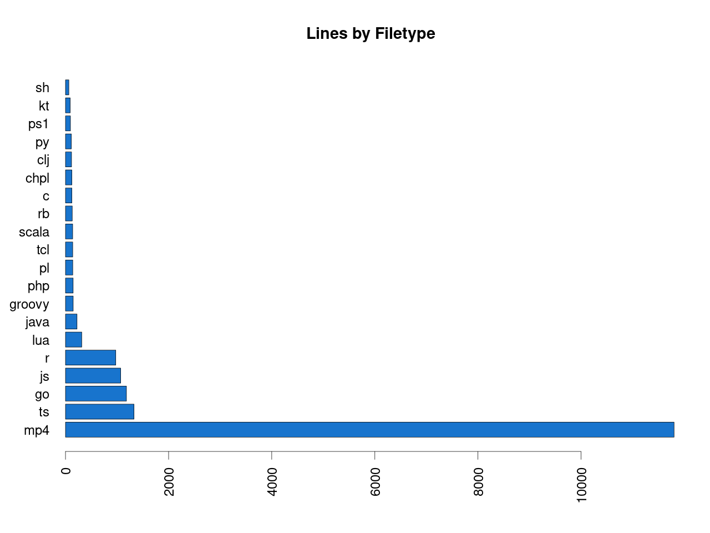

# Advent of Code

## 2021

Giving this another go because I had so much fun last year, even if I didn't
make it to the end. Not committing to the "language of the day" approach, but
we'll see.

- [Day 1: Sonar Sweep](2021/01/depthFinder.js) (JavaScript)
- [Day 2: Dive!](2021/02/dive.lua) (Lua)
- [Day 3: Binary Diagnostic](2021/03/binarydiagnostic.r) (R)
- [Day 4: Giant Squid Bingo](2021/04/src/index.ts) (TypeScript)
- [Day 5: Hydrothermal Venture](2021/05/thermalvents.r) (R)
- [Day 6: Lanternfish](2021/06/multifish.js) (JavaScript)
- [Day 7: The Treachery of Whales](2021/07/crabs.js) (JavaScript)

## 2020

Showing my progress through [Advent of Code](https://adventofcode.com/2020). As
a product manager, my primary work is not writing code. And some of what I know
well is a bit dated. So I've decided to lean into my experience with traditional
"Advent Calendars" which end up being more like samplers of many things.

| Challenge                                                       | Language   |
|-----------------------------------------------------------------|------------|
| [Day 1: Report Repair](2020/01/expense_report.sh)               | Bash       |
| [Day 2: Password Philosophy](2020/02/password_validator.ps1)    | PowerShell |
| [Day 3: Toboggan Trajectory](2020/03/avoid_trees.c)             | C          |
| [Day 4: Passport Processing](2020/04/PassportScanner.java)      | Java       |
| [Day 5: Binary Boarding](2020/05/pass_parser.clj)               | Clojure    |
| [Day 6: Custom Customs](2020/06/CustomsPrep.kt)                 | Kotlin     |
| Day 7: Handy Haversacks: [Part 1](2020/07/LuggageCombos.lua), [Part 2](2020/07/LuggageCombosTwo.lua) | Lua |
| [Day 8: Handheld Halting](2020/08/videogame.pl)                 | Perl       |
| [Day 9: Encoding Error](2020/09/encoding_error.chpl)            | Chapel     |
| [Day 10: Adapter Array](2020/10/ChargerConundrum.groovy)        | Groovy     |
| [Day 11: Seating System](2020/11/seatshuffling.r)               | R          |
| Day 12: Rain Risk: [Part 1](2020/12/navigate.tcl), [Part 2](2020/12/navigate_two.tcl) | TCL |
| [Day 13: Shuttle Search](2020/13/busdepot.scala)                | Scala      |
| Day 14: Docking Data: [Part 1](2020/14/dockingprocedures.go), [Part 2](2020/14/dockingprocedurestwo.go) | Go |
| Day 15: Rambunctious Recitation: [Part 1](2020/15/memory_game.rb), [Part 2](2020/15/memory_game_two.rb) | Ruby |
| Day 16: Ticket Translation: [Part 1](2020/16/ticketing.js), [Part 2](2020/16/ticketing_two.js) | JavaScript |
| ~Day 17: Conway Cubes*~                                         |            |
| [Day 18: Operation Order](2020/18/homework.php)                 | PHP        |
| [Day 19, Part 1: Monster Messages](2020/19/message_decoder.py)  | Python     |
\* _I'll come back to this one. I got scared._

_Take this with a grain of salt:_ I comment heavily, and some problems are
easier than others. Also I started most of these days with a Hello World so I
may be missing some idiomatic methods or efficiencies. But I still thought it
was fun.
